# ER — maya_platform

maya_platform es la capa origen del ecosistema Maya. Actúa como fuente de verdad para datos de usuarios, equipos y catálogos académicos mediante **postgres_fdw** (Foreign Data Wrapper) que proyecta tablas y vistas remotas desde Odoo. En entornos de testing, utiliza tablas físicas locales. Las relaciones son **lógicas** — postgres_fdw no permite constraints FK físicos sobre foreign tables / vistas.

## Diagrama

```mermaid
erDiagram
    USERS ||--o{ TEAM_MEMBERS : "miembro"
    USERS ||--o{ USER_STUDY_TYPES : "asignado a"
    USERS ||--o{ USER_STUDIES : "ve"
    USERS ||--o{ USER_COURSE_MODULES : "imparte"
    USERS ||--o{ USER_RESOLVED_PERMISSIONS : "tiene"
    TEAMS ||--o{ TEAM_MEMBERS : "contiene"
    STUDY_TYPES ||--o{ STUDIES : "clasifica"
    STUDY_TYPES ||--o{ USER_STUDY_TYPES : "asigna a"
    STUDIES ||--o{ COURSE_MODULES : "contiene"
    STUDIES ||--o{ USER_STUDIES : "visto por"
    COURSE_MODULES ||--o{ USER_COURSE_MODULES : "impartido por"
    JOBS ||--o{ FAILED_JOBS : "puede fallar"
    JOBS ||--o{ JOB_BATCHES : "pertenece a"

    USERS {
        varchar_255 id PK "UUID Keycloak"
        varchar_255 name "display_name Odoo"
        varchar_255 email UK "correo"
        varchar_150 first_name
        varchar_150 last_name
        varchar_150 username "login Odoo"
        varchar_64 employee_id "FK maya_core_employee"
        varchar_32 dni
        varchar_64 employee_type
        boolean is_active "defecto true"
    }

    TEAMS {
        varchar_255 id PK "UUID"
        varchar_255 name "no null"
        text description
        varchar_255 owner_id "FK users (lógico)"
        boolean is_department "defecto false"
        timestamp created_at
        timestamp updated_at
        timestamp deleted_at
    }

    TEAM_MEMBERS {
        varchar_255 id PK "UUID"
        varchar_255 team_id FK "FDW (lógico)"
        varchar_255 user_id FK "FDW (lógico)"
        varchar_50 role "defecto 'member'"
        timestamp created_at
        timestamp updated_at
    }

    STUDY_TYPES {
        varchar_255 id PK "id::text res_company"
        varchar_64 code "name res_company (FP/BACH/FPA)"
        varchar_255 name "name res_company"
    }

    STUDIES {
        varchar_255 id PK "id::text maya_core_study"
        varchar_7 code
        varchar_255 study_type_id FK "company_id (lógico)"
        varchar_255 name "(name->>'en_US')"
        boolean active "defecto true, filtrado"
    }

    COURSE_MODULES {
        varchar_255 id PK "{study_id}_{subject_id}"
        varchar_11 code "maya_core_subject.code"
        varchar_255 year "maya_core_subject.year"
        varchar_255 name "(maya_core_subject.name->>'en_US')"
        varchar_255 study_id FK "maya_core_study_id::text (lógico)"
    }

    USER_STUDY_TYPES {
        varchar_255 id PK "md5 hash"
        varchar_255 user_id FK "keycloak_user_id (lógico)"
        varchar_255 study_type_id FK "res_company.id::text (lógico)"
        timestamp created_at "NULL en FDW"
        timestamp updated_at "NULL en FDW"
    }

    USER_STUDIES {
        varchar_255 id PK "md5 hash"
        varchar_255 user_id FK "keycloak_user_id (lógico)"
        varchar_255 study_id FK "maya_core_study.id::text (lógico)"
        timestamp created_at "s.create_date"
        timestamp updated_at "s.write_date"
    }

    USER_COURSE_MODULES {
        varchar_255 id PK "md5 hash"
        varchar_255 user_id FK "keycloak_user_id (lógico)"
        varchar_255 module_id FK "{study_id}_{subject_id} (lógico)"
        timestamp created_at "maya_core_subject_employee_rel.create_date"
        timestamp updated_at "maya_core_subject_employee_rel.write_date"
    }

    USER_RESOLVED_PERMISSIONS {
        varchar_255 user_id FK "Keycloak UUID (lógico)"
        varchar_191 permission_slug "nombre permiso (ej: 'audit.login')"
    }

    JOBS {
        bigint id PK "AUTO_INCREMENT"
        varchar queue "nombre cola, indexado"
        longtext payload "JSON serializado"
        tinyint attempts "reintentos"
        int reserved_at "NULL o timestamp Unix"
        int available_at "timestamp Unix"
        int created_at "timestamp Unix"
    }

    JOB_BATCHES {
        varchar id PK "UUID o string"
        varchar name "nombre del batch"
        int total_jobs
        int pending_jobs
        int failed_jobs
        longtext failed_job_ids "JSON array"
        mediumtext options "JSON opciones, nullable"
        int cancelled_at "timestamp Unix, nullable"
        int created_at "timestamp Unix"
        int finished_at "timestamp Unix, nullable"
    }

    FAILED_JOBS {
        bigint id PK "AUTO_INCREMENT"
        varchar uuid UK "UUID único"
        text connection "conexión DB (ej: 'pgsql')"
        text queue "nombre cola"
        longtext payload "JSON serializado"
        longtext exception "stack trace completo"
        timestamp failed_at "CURRENT_TIMESTAMP por defecto"
    }
```

## Clasificación de tablas

| Entidad | Mecanismo | Fuente Odoo | Evidencia |
|---------|-----------|------------|-----------|
| `users` | FDW Odoo (read-only) | `v_app_users` (vista canónica) | `/packages/php/shared-profile-laravel/database/migrations/users/2026_05_19_000001_create_users_foreign_table.php:8` |
| `teams` | FDW Odoo (read-only) | `v_dms_teams` (maya_core_team) | `/packages/php/shared-profile-laravel/database/migrations/teams/2026_05_18_000001_create_teams_foreign_table.php:8` |
| `team_members` | FDW Odoo (read-only) | `v_dms_team_members` (maya_core_employee_maya_core_team_rel) | `/packages/php/shared-profile-laravel/database/migrations/teams/2026_05_18_000002_create_team_members_foreign_table.php:8` |
| `study_types` | VISTA derivada (FDW + filtro) | `res_company` (hijas, excluye root id=1) | `/packages/php/shared-profile-laravel/database/migrations/academic-catalogs/2026_05_22_000000_create_study_types_catalog_foreign_table.php:8` |
| `studies` | FDW Odoo (read-only, filtrado) | `maya_core_study` (active=true) | `/packages/php/shared-profile-laravel/database/migrations/academic-catalogs/2026_05_22_000001_create_studies_catalog_foreign_table.php:8` |
| `course_modules` | VISTA derivada (JOIN FDW) | `maya_core_study_maya_core_subject_rel` + `maya_core_subject` | `/packages/php/shared-profile-laravel/database/migrations/academic-catalogs/2026_05_22_000002_create_course_modules_catalog_foreign_table.php:8` |
| `user_study_types` | VISTA derivada (JOIN FDW) | `res_company_users_rel` + `res_users` | `/packages/php/shared-profile-laravel/database/migrations/academic-assignments/2026_05_18_000003_create_user_study_types_foreign_table.php:8` |
| `user_studies` | VISTA derivada (JOIN FDW) | `res_company_users_rel` + `maya_core_study` + `res_users` | `/packages/php/shared-profile-laravel/database/migrations/academic-assignments/2026_05_18_000004_create_user_studies_foreign_table.php:8` |
| `user_course_modules` | VISTA derivada (JOIN FDW) | `maya_core_subject_employee_rel` + `maya_core_employee` + `res_users` | `/packages/php/shared-profile-laravel/database/migrations/academic-assignments/2026_05_18_000005_create_user_course_modules_foreign_table.php:8` |
| `user_resolved_permissions` | FDW maya_auth (read-only) | `v_<app>_user_permissions` (dinámica) | `/packages/php/shared-profile-laravel/database/migrations/user-permissions/2026_05_18_000010_create_user_resolved_permissions_view.php:21` |

### Tablas de framework/sistema

Creadas por el paquete `shared-messaging-laravel` para gestión de jobs y batches:

| Tabla | Descripción |
|-------|-------------|
| `jobs` | Cola de trabajos async (Laravel Job Queue) |
| `job_batches` | Agrupaciones de trabajos para procesamiento en batch |
| `failed_jobs` | Registro de trabajos fallidos (audit y debugging) |

Fuente: `/packages/php/shared-messaging-laravel/database/migrations/2026_05_07_000000_create_messaging_jobs_table.php:9`

## Discrepancias

Ninguna — capa FDW origen coherente. Todas las foreign tables/vistas apuntan a Odoo mediante server FDW `odoo_server` (compartido). Las relaciones entre entidades son **lógicas** (sin constraints FK físicos): postgres_fdw no permite `REFERENCES` sobre foreign tables o vistas, la consistencia se garantiza desde la vista origen en Odoo. En testing, las tablas físicas reproducen la estructura con índices y constraints únicos equivalentes.
